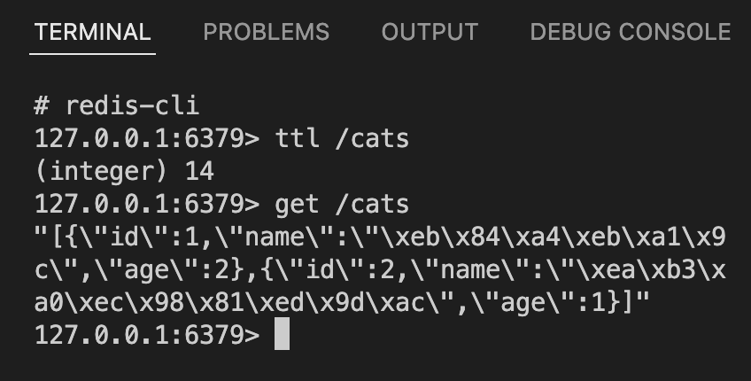

::제목::
Nestjs REST 애플리케이션의 캐시처리와 캐시 무효화

# 캐시 개요

캐싱/캐시처리는 일반적으로 성능 향상을 위한 캐시 등록, 검색, 무효화등의 작업을 통칭하는 의미입니다. 캐시는 캐싱을 통해 처리되는 데이터 스토리지 계층을 의미합니다.

캐시/캐시처리는 컴퓨팅 인프라의 다양한 측면에서 구성되어 있습니다. 하드웨어 수준에서부터 OS수준의 시스템 소프트웨어, DNS/CDN 등 네트워크 인프라, 데이터베이스, 브라우저, 패키지매니저, 웹 애플리케이션, 유저와 맞닿은 여러 많은 프로그램 등 상상할 수 있는 거의 모든 컴퓨팅 인프라의 성능 향상을 위해 구성되어 있습니다.

캐시는 성능 향상이라는 목적에 맞게 주로 RAM과 같이 빠르게 액세스할 수 있는 하드웨어에 ㅇ됩니다. 웹 환경에서 주로 캐시되는 데이터의 유형에는 데이터베이스 쿼리 결과, 많은 시간이 필요한 계산 작업 결과, API 응답, HTML파일,JS파일,이미지와 같은 리소스 등이 포함될 수 있습니다.

캐시는 빠른 액세스가 가능한 하드웨어에서 데이터를 가져오면서 속도 향상을 노리며, 동시에 동일 데이터에 대한 접근 시 미리 구성된 데이터를 응답하여 불필요한 검색 작업을 방지할 수 있습니다. 이 때, 캐시된 데이터가 현 시점에서 유효한 데이터로 유지될 수 있도록 캐시 만료 기간을 설정하거나 적절히 캐시를 무효화하는 처리를 구현할 필요가 있습니다. 캐시되는 데이터의 유형과 그 상황에 따라 적절한 상황에서 무효화할 수 있으며 적절한 만료 시간을 가지도록 구성해야 합니다.

캐시는 개별 컴퓨터/서버/장비에서 구성될 수 있으나 또한 분산 컴퓨팅 환경에서 캐시 계층을 독립적으로 따로 구성할 수도 있습니다. 독립적으로 구성된 캐시계층은 여러 많은 환경에서 동일한 데이터에 액세스할 수 있도록 합니다.

주로 사용되는 캐시 계층을 위한 소프트웨어는 다음과 같습니다.

- Redis: key-value 기반 In-memory 데이터베이스
- Memcached: 범용 분산 캐시 시스템

# Nestjs 요청 주기와 Interceptor

Nestjs는 Node.js + Typescript 생태계에서 확장성있는 웹 애플리케이션을 구성하기 위한 프레임워크 입니다. Nest.js는 JAVA의 Spring, C#의 ASP .NET Core, PHP의 Laravel, Python의 Django과 비슷한 위치를 차지합니다.

Nestjs에서의 캐시처리에 대해 알아보기 위해서 먼저 Nestjs에서의 요청 처리 주기를 확인합니다. Nestjs의 요청 주기에 대한 더 자세한 내용은 https://docs.nestjs.com/faq/request-lifecycle 에서 확인할 수 있습니다.

1. 요청
2. 미들웨어(Middlewares)
3. 가드(Guards)
4. 인터셉터(Interceptros) - 컨트롤러 핸들러 실행 이전
5. 파이프(Pipes)
6. 컨트롤러(Controller) 메서드 핸들러
7. 서비스
8. 인터셉터 - 컨트롤러 실행 이후
9. 예외 필터(Exception filters)
10. 응답

Nestjs에서 캐싱처리는 주로 [Interceptors](https://docs.nestjs.com/interceptors#interceptors)가 처리합니다. 요청 주기에서 Interceptor는 비즈니스 로직이 구성되어 있는 서비스와 컨트롤러 코드가 실행되기 이전, 그리고 비즈니스 로직 코드가 실행된 이후 총 두번 거쳐가게 됩니다. 요청과 응답의 중간에 위치하므로 Interceptor 내부에서는 요청 정보와 응답 정보 모두 액세스 가능하며, 이를 활용해 캐싱(Caching), 로깅(Logging), 직렬화(Serialization), 응답 변환(Transforming) 등 여러 작업을 처리할 수 있습니다.

# Nestjs 캐싱

웹 애플리케이션에서 주로 캐시되는 데이터는 응답 데이터입니다. 간단히 생각해보았을 때 Interceptor를 이용해 캐싱 작업을 다음과 같이 처리할 수 있습니다.

캐시되지 않은 데이터에 대한 요청
- 요청이 캐시 가능한 요청인지 확인합니다.
- 이후, 요청에 대해 캐시된 데이터를 확인하고, 캐시된 데이터가 없으므로 컨트롤러/서비스 등 비즈니스 로직을 실행합니다.
- 비즈니스 로직 실행 이후, 응답할 데이터를 요청된 endpoint를 기준으로 캐싱 처리합니다.

캐시된 데이터에 대한 요청
- 요청이 캐시 가능한 요청인지 확인합니다.
- 요청 엔드포인트로 캐시된 데이터를 확인하고,미리 캐시된 데이터가 있는 경우 비즈니스 로직을 실행하지 않고 캐시된 데이터를 곧바로 반환합니다.

실제 Nestjs에서 제공하는 `CacheInterceptor`는 위와 동일한 작업을 처리하고 있으며, 여러 캐시 스토어에서 동일한 인터페이스를 통해 캐시를 제어할 수 있도록 node-cache-manager[https://github.com/BryanDonovan/node-cache-manager]를 내부적으로 활용합니다.

다음은 간략하게 추린 Nestjs의 `CacheInterceptor` 코드 일부입니다. 전체 코드는 [Nestjs Github 리파지토리](https://github.com/nestjs/nest/blob/ad39c3cfd78e94f191d51ae5799ad9dadb522d38/packages/common/cache/interceptors/cache.interceptor.ts)에서 확인할 수 있습니다.

```ts
@Injectable()
export class CacheInterceptor implements NestInterceptor {
  protected allowedMethods = ['GET'];
  constructor(
    @Inject(CACHE_MANAGER) protected readonly cacheManager: any,
    @Inject(REFLECTOR) protected readonly reflector: any,
  ) {}

  async intercept(
    context: ExecutionContext,
    next: CallHandler,
  ): Promise<Observable<any>> {
    const key = this.trackBy(context); // 캐시 key를 구성, 캐시할 수 없는 경우 falsy값을 반환
    if (!key) return next.handle(); // 캐시할 수 없는 경우 비즈니스로직을 처리

    try {
      const value = await this.cacheManager.get(key); // 캐시된 데이터를 확인
      if (!isNil(value)) return of(value); // 캐시된 데이터가 있는 경우 캐시된 데이터를 응답

      // 캐시된 데이터가 없는 경우
      // @CahceTTL() 데코레이터로 작성한 캐시 TTL(Time To Live) 메타데이터 조회
      const ttlValueOrFactory = this.reflector.get(CACHE_TTL_METADATA, context.getHandler()) ?? null;
      const ttl = isFunction(ttlValueOrFactory)  ? await ttlValueOrFactory(context) : ttlValueOrFactory;
      return next.handle().pipe(
        tap(response => {
          // 응답하며 동시에, 응답 데이터 캐싱 처리 진행(입력한 TTL 만큼)
          const args = isNil(ttl) ? [key, response] : [key, response, { ttl }];
          this.cacheManager.set(...args);
        }),
      );
    } catch {
      return next.handle(); // 캐시 처리, 캐시 조회 과정에서 오류 발생의 경우 비즈니스로직을 그대로 처리
    }
  }
}
```

잠시 설명하면 다음과 같습니다.

- 따로 구성된 `trackBy` 메서드를 통해 캐시처리할 수 있는 요청인지 판단합니다. 기본적으로 `CacheInterceptor`는 GET 메서드의 HTTP 요청에 대해서만 캐싱 처리하도록 구성되어 있습니다.
- 또한 `trackBy` 메서드는 동시에, 캐시 키를 구성합니다. `trackBy` 메서드를 오버라이딩하지 않았을 경우 기본적으로 요청 Endpoint가 캐시 키로 사용됩니다. (Express 베이스 Nestjs 서버를 구성하셨다면, `req.originalUrl` 값입니다.)
- `trackBy` 메서드에서 캐시 키가 반환되어 캐싱 처리를 진행할 수 있는 경우, 먼저 `cacheManager`를 통해 해당 캐시데이터를 조회합니다. 캐시 데이터가 있는 경우 곧바로 캐시된 데이터를 응답합니다.
- 캐시데이터가 없는 경우 `@CacheTTL()`과 `@CacheKey()` 데코레이터를 통해 입력된 캐시 관련 메타데이터를 조회합니다.
- `next.handle()` 을 통해 비즈니스 로직이 실행되도록한 뒤, 응답된 데이터를 RxJS `tap` operator 내부에서 `cacheManager`를 통해 조회한 메타데이터들에 기반해 캐시 처리합니다.

## REST API 응답 캐싱 구현

Nestjs에 의해 제공되는 CacheInterceptor를 사용하기 위해, 내부적으로 사용되는 cache-manager 패키지를 설치해야 합니다.

```bash
yarn add cache-manager
yarn add --dev @types/cache-manager
```

설치 이후, 캐싱 기능을 사용할 모듈에서 캐시 모듈을 불러오도록 구성합니다. Nestjs앱에 전체에 걸쳐 전역적으로 사용하고자 한다면 `app.module.ts`에서 글로벌 모듈로 구성하도록 합니다.

```ts
// src/app.module.ts
import { CacheModule, Module } from '@nestjs/common';
import { AppController } from './app.controller';
import { AppService } from './app.service';
import { CatsModule } from './modules/cats/cats.module';

@Module({
  imports: [
    CacheModule.register({
      isGlobal: true,
    }),
    CatsModule,
  ],
})
export class AppModule {}
```

이제 CacheModule은 전역 모듈이므로, 각 하위 모듈에서 import 구성하지 않아도 사용될 수 있습니다. CacheModule은 기본적으로 TTL 5초, 최대 캐시 요소의 개수를 100개로 설정합니다. 이를 변경하고자 한다면 `CacheModule.register` 함수의 `ttl`, `max` 옵션값을 수정할 수 있습니다.

```ts
// src/modules/cats/cats.controller.ts
import { Controller, Get, Param, UseInterceptors } from '@nestjs/common';

import { CatsService } from './cats.service';

@Controller('cats')
@UseInterceptors(CacheInterceptor)
export class CatsController {
  constructor(private readonly catsService: CatsService) {}

  @Get()
  findAll() {
    return this.catsService.findAll();
  }

  @Get(':id')
  findOne(@Param('id') id: number) {
    return this.catsService.findOne(id);
  }
}
```

Interceptor는 라우트 메서드 핸들러, 컨트롤러, 모듈 수준, 글로벌 수준에서 적용할 수 있습니다. 위 코드에서는 컨트롤러 전체에 CacheInterceptor를 구성한 모습을 확인할 수 있습니다. `CatsController`의 모든 GET 메서드 핸들러의 응답값은 모두 캐시됩니다. `CatsController.findAll` 의 응답값은 `/cats` 캐시 키로 캐싱될 것이며, `CatsController.findOne` 의 응답값은 `/cats/1`, `/cats/2`와 같은 키로 캐싱될 것입니다.

캐시키를 엔드포인트 URL이 아닌 다른 값으로 구성하고자 한다면 `@CacheKey('some-key')` 데코레이터를 작성할 수 있습니다. 특정 라우트 핸들러의 TTL을 다른 값으로 구성하고자 한다면 `@CacheTTL(300)` 과 같이 구성할 수 있습니다. `@CacheKey`와 `@CacheTTL` 데코레이터는 사용자 정의 메타데이터를 구성할 수 있도록 하는 [SetMetadata](https://github.com/nestjs/nest/blob/99ee3fd99341bcddfa408d1604050a9571b19bc9/packages/common/decorators/core/set-metadata.decorator.ts) 데코레이터의 확장 구성된 버전입니다.

## 캐시 스토어 활용하기

아무런 캐시 스토어 설정을 하지 않은 경우 Nestjs CacheModule은 기본적으로 서버 메모리상에 캐시를 저장합니다. 이와 같은 구성은 여러 Nestjs 인스턴스가 실행되어야 하는 환경에서 비효율적일 수 있습니다. 우리는 여러 서버 인스턴스가 공유하는 독립적인 캐시 스토어를 구성할 수 있습니다. cache-manager는 캐시 스토어로 사용될 수 있는 여러 엔진과 함께 동작될 수 있습니다. (Redis, Memcached, mongoDB 등)

필자는 [cache-manager-ioredis](https://github.com/dabroek/node-cache-manager-ioredis) 를 통해 Redis 클러스터와 연결합니다. Redis 클러스터를 Docker로 구성하는 방법은 [이전 포스트](https://hwasurr.io/redis/cluster/)에서 확인할 수 있습니다. 이미 Redis 클러스터가 구성되어 있다는 가정하에, Nestjs 상에서의 구현만 확인합니다.

CacheModule을 전역 모듈로 구성한 `app.module.ts` 에서 `CacheModule.register` 메서드의 옵션을 다음과 같이 작성합니다.

```ts
// src/app.module.ts
import { CacheModule, Module } from '@nestjs/common';
import * as redisCacheStore from 'cache-manager-ioredis';
import { CatsModule } from './modules/cats/cats.module';

@Module({
  imports: [
    CacheModule.register({
      isGlobal: true,
      store: redisCacheStore,
      clusterConfig: {
        nodes: [{ host: 'localhost', port: 6379 }],
        options: { ttl: 10 },
      },
    }),
    CatsModule,
  ],
  controllers: [],
  providers: [],
})
export class AppModule {}
```

여기서 유의할 점은 기존과는 달리 `ttl` 설정을 `clusterConfig.options.ttl` 에서 구성하여야 한다는 점입니다. 이렇게 구성한 뒤, 앞서 작성한 GET `/cats` 엔드포인트에 HTTP 요청시, 적절한 응답이 도착하면서, Redis상에 `/cats` 라는 키로 캐시되는 것을 확인할 수 있으며, 해당 캐시의 `ttl`이 작성한대로 15초로 적용되는 것을 확인할 수 있습니다.



## Nestjs 캐시 무효화

TTL을 길게 설정하여 캐시가 더 오래 남아 활용되도록 구성하면 반복적인 비즈니스 로직의 실행을 더 많이 줄여 자원을 아낄 수 있고, 더 빠른 접근을 가능케 할 수 있습니다. 그렇지만 언제나 만료기간이 긴 캐시를 사용할 수 만은 없습니다. 오랜 기간 변경되지 않아도 되는 데이터가 있는 반면, 짧은 변경 주기를 가지는 데이터도 있습니다. '캐시를 얼마나 오래 유지해야 하는가?'의 문제는 언제나 답이 없습니다. 데이터의 성격과 상황에 따라 알맞게 설정해야 할 것입니다.

만료기간이 긴 경우 캐시 데이터가 오래된 데이터일 가능성이 높아지며, 만료기간이 짧은 경우 캐시 효율성이 낮아집니다. 물론 캐시처리 하지 않는 것보다는 짧은 유효기간의 캐시를 두는 것이 성능 향상에 있어 좋은 결과를 불러올 수는 있을 것입니다.

만료기간과 별개로, 캐시는 언제나 오래된(stale) 상태가 될 수 있습니다. 새로운 데이터의 생성, 기존 데이터의 수정/삭제 작업이 일어나면 해당하는 데이터의 기존 캐시는 더 이상 최신의 데이터가 아니게 되므로, 삭제되거나 수정되어야 합니다.

Nestjs에서는 Interceptor를 통해 캐시를 자동으로 구성할 수 있지만, CacheManager를 직접 접근하여 수동으로 사용할 수도 있습니다. 사용하고자 하는 문맥에서 `@Inject()` 데코레이터를 통해 주입하여 CacheManager 객체를 가져올 수 있습니다.

```ts
// src/modules/cats/cats.service.ts
import { CACHE_MANAGER, Inject, Injectable } from '@nestjs/common';
import { Cache } from 'cache-manager';
import { CreateCatDto, UpdateCatDto } from './dto/cats.dto';
import { Cat } from './model/cats.model';

@Injectable()
export class CatsService {
  constructor(@Inject(CACHE_MANAGER) private cacheManager: Cache) {}
  public async findAll(): Promise<Cat[]> {
    ...
  }

  public async findOne(id: Cat['id']): Promise<Cat> {
    ...
  }

  public async create(dto: CreateCatDto): Promise<void> {
    ...
    await this.cacheManager.del('/cats');
    return;
  }
}
```

`/cats`, `/cats?search=나비`, `/cats?take=5&skip=6` 과 같이 쿼리스트링에 따라 동일한 데이터라도 여러 캐시가 구성될 수 있습니다. 이모든 캐시를 한번에 제거하기 위해 우리는 다음과 같이 구성할 수 있습니다. Redis 클러스터로 구성된 여러 Redis 인스턴스에 대해 한번에 `KEYS`, `DEL` 과 같은 명령어를 사용할 수 없으므로 클러스터 노드를 모두 가져와 반복하여 작업하도록 구성합니다.

```ts
// src/modules/cats/cats.service.ts
@Injectable()
export class CatsService {
  ...

  private async _clearCaches(cacheKeys: string[]): Promise<boolean[]> {
    const client: Cluster = await this.cacheManager.store.getClient();
    const redisNodes = client.nodes() as Redis[];

    return Promise.all(
      cacheKeys.map(async (cacheKey) => {
        const _keys: boolean[][] = await Promise.all(
          redisNodes.map(async (redis) => {
            const k = await redis.keys(`*${cacheKey}*`);
            return Promise.all(k.map((_k) => !!redis.del(_k))).catch((err) => {
              console.error(`An error occurred during clear caches - ${cacheKey}`, err);
              return [false];
            });
          }),
        );
        const results = _.flatten(_keys);
        return results.every((r) => !!r);
      }),
    );
  }
}
```

`_clearCaches` 프라이빗 함수는 삭제할 캐시키 배열을 전달받아 각 키마다 각 레디스 클러스터 노드에서 해당 키를 포함하는 캐시를 삭제합니다.

```ts
// src/modules/cats/cats.service.ts
@Injectable()
export class CatsService {
  constructor(@Inject(CACHE_MANAGER) private cacheManager: Cache) {}
  ...
  public async create(dto: CreateCatDto): Promise<void> {
    ...
    await this._clearCaches(['/cats']);
    return;
  }
}
```

### Interceptors 에서 캐시 무효화하는 방법

캐시 관리가 필요한 Service에서 캐시 무효화 함수를 구성하는 것은 비즈니스 로직에 가까운 곳에서 캐시를 관리할 수 있다는 장점이 있습니다만, 몇 가지 문제점을 가집니다.

- 동일한 코드의 반복

캐시를 무효화하는 동일한 코드가 여러번 반복되어야 합니다. 물론 이를 위해 캐시 처리작업이 구성된 Class를 구성하고 상속 받아 작업을 처리할 수 있으나 이 역시 상속받는 코드를 매번 작성해야 하는 번거로움이 있을 수 있습니다.

- '캐시처리' 작업을 여러 장소에 걸쳐 구현하여야 함

Interceptor를 활용해 캐시를 생성하도록 구성하는 작업은 Controller에서 진행하고, 캐시무효화 작업은 Service 측에서 진행되므로 유지보수의 비효율을 가져오며 기능적 응집도가 낮은 설계로 나아갑니다.

- '캐시 관리'는 서비스가 가지는 주요 로직이라기 보다 부가적인 로직에 가깝다.

유지보수 편의를 위한 좋은 설계는 높은 응집도를 가지고 낮은 결합도를 가지도록 하는 것입니다. 하나의 서비스 클래스는 해당하는 기능만을 수행하는 것이 바람직합니다.

::Nestjs에서는 Interceptor를 이용해 AOP(Aspect Oriented Programming) 를 구성할 수 있습니다.::

캐싱 처리를 Interceptor를 통해 따로 떼어내어 구성했다면, 캐시 무효화 역시 그렇게 하지 못할 이유는 없습니다. Nestjs에 의해 제공되는 CacheInterceptor에 몇 가지 기능을 추가하여 확장한 `HttpCacheInterceptor`를 구성하며 자동적으로 캐시를 무효화 하도록 하는 방법을 알아봅니다.

캐시 무효화 처리를 포함하는 새롭게 구성할 HttpCacheInterceptor의 요구사항을 다음과 같이 정리해 볼 수 있습니다.

- 기존 CacheInterceptor의 기능을 훼손하지 않는다.
- POST(생성), PATCH(수정), PUT(덮어쓰기), DELETE(삭제) 요청시 연관된 캐시를 무효화 처리할 수 있어야 한다.
- GET 요청 endpoint와 POST, PATCH, PUT, DELETE 요청 endpoint가 다를 수 있으므로, 삭제할 캐시 키를 개발자가 직접 작성할 수 있어야 한다.
    - 이 경우 캐시를 제거할 key는 @CacheKey()와 @CacheTTL() 과 같이 `SetMetadata`를 통해 구성한 커스텀 메타데이터를 통해 명시하고, Interceptor에서 가져와 해당 키의 캐시를 무효화하도록 구성.

(CacheInterceptor 상속하는 HttpCacheInterceptor 구성)

# 요약

Nestjs 에서의 캐시처리에 대해 알아보았다. 캐시는 오래된 데이터가 될 가능성이 있으므로 무효화할 수 있어야 하고, 이를 각 서비스 로직에서 직접 처리할 수 있지만 AOP 방식으로 구현하여 책임을 분리하는 작업을 함께 알아보았다. 다음에는 Nestjs + GraphQL 서버의 캐싱 방법과 캐시 무효화 방법에 대해 알아볼 수 있을 것. Interceptor의 작동방식과 GraphQL Resolver 작동 방식 간의 약간의 불일치를 확인하고 그를 해결할 수 있는 방식을 알아볼 수 있을 것이다.
(Normalized Cache를 적용할 것인지, 단순 Document Cache를 적용할 것인지.)

# 참조 문서

- https://docs.nestjs.com/
- https://aws.amazon.com/ko/caching/
- https://azure.microsoft.com/ko-kr/services/cache/#overview
- https://expressjs.com/ko/api.html